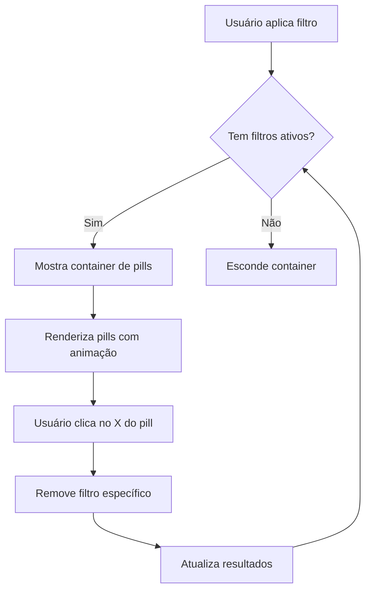

# Active Filters UX - Sistema de Pills de Filtros Ativos

## 📋 Visão Geral

Sistema de **Active Filters Pills** que melhora a experiência de busca e filtragem de vagas, inspirado em best practices de job boards como LinkedIn, Indeed e WeWorkRemotely.

## ✨ Features Implementadas

### 1. **Pills de Filtros Ativos**
- Aparecem acima dos cards de vagas quando filtros são aplicados
- Cada filtro ativo é exibido como um "pill" (pílula) clicável
- Design Canvas: bordas pretas, sombras duras, hover com efeito "press"

### 2. **Remoção Individual**
- Cada pill tem um ícone "X" que permite remover o filtro específico
- Animação de rotação no hover (90°)
- Feedback visual imediato ao remover

### 3. **Limpar Tudo**
- Botão "Limpar tudo" remove todos os filtros de uma vez
- Disponível tanto na seção de filtros ativos quanto no empty state

### 4. **Animações Suaves**
- **fade-in-up**: Container dos filtros ativos aparece suavemente
- **pill-pop-in**: Cada pill aparece com animação "pop" elástica
- **pill-pop-out**: Pills são removidos com animação suave
- **Staggered animation**: Pills aparecem sequencialmente (delay de 0.05s)

### 5. **Estados de Filtro Suportados**

```typescript
type FilterState = {
  search: string;      // Busca por texto
  category: string;    // Categoria/Área (Game Dev, 3D, etc)
  tag: string | null;  // Skill específica
}
```

## 🎨 Design System Canvas

### Estilo dos Pills
```css
.active-filter-pill {
  border: 2px solid #000;           /* Borda preta Canvas */
  background: white;
  box-shadow: 2px 2px 0px 0px #000; /* Sombra dura */
  font-weight: bold;
  text-transform: uppercase;
  letter-spacing: 0.05em;
}

.active-filter-pill:hover {
  background: #000;                  /* Hover inverte cores */
  color: white;
  box-shadow: none;                  /* Remove sombra */
  transform: translate(2px, 2px);    /* Efeito "press" */
}
```

### Animações
```css
/* Pop-in elástico */
@keyframes pill-pop-in {
  0% {
    opacity: 0;
    transform: scale(0.8) translateY(10px);
  }
  60% {
    transform: scale(1.05) translateY(-2px);
  }
  100% {
    opacity: 1;
    transform: scale(1) translateY(0);
  }
}
```

## 🔄 Fluxo de Interação



## 📱 Responsividade

### Desktop (lg+)
- Pills aparecem em uma linha horizontal com wrap
- Botão "Limpar tudo" à direita
- Espaçamento generoso (gap-3)

### Mobile (< lg)
- Pills se adaptam em múltiplas linhas (flex-wrap)
- Botão "Limpar tudo" fica em linha separada
- Touch targets aumentados para melhor usabilidade

## 🌍 i18n Support

### Português (pt-BR)
```typescript
activeFilters: {
  title: 'Filtros ativos',
  clearAll: 'Limpar tudo',
  remove: 'Remover',
  search: 'Busca',
  category: 'Área',
  tag: 'Skill',
}
```

### English (en)
```typescript
activeFilters: {
  title: 'Active filters',
  clearAll: 'Clear all',
  remove: 'Remove',
  search: 'Search',
  category: 'Category',
  tag: 'Skill',
}
```

## 🧪 Como Testar

### 1. Teste Básico
1. Acesse a home page
2. Digite algo no campo de busca
3. Verifique se aparece o pill "Busca: [termo]"
4. Clique no X do pill e veja se remove o filtro

### 2. Teste de Múltiplos Filtros
1. Aplique busca + categoria + skill
2. Verifique se todos os pills aparecem
3. Clique em "Limpar tudo"
4. Verifique se todos os filtros são removidos

### 3. Teste de Animações
1. Aplique vários filtros rapidamente
2. Observe a animação staggered (sequencial)
3. Faça hover sobre os pills
4. Verifique o efeito de rotação do ícone X

### 4. Teste Responsivo
1. Redimensione a janela para mobile
2. Verifique se os pills se ajustam (wrap)
3. Teste a usabilidade dos botões no mobile

## 🎯 Best Practices Implementadas

### 1. **Visual Feedback Imediato**
✅ Usuário vê instantaneamente quais filtros estão ativos
✅ Sombras e animações reforçam a interatividade

### 2. **Affordance Clara**
✅ Ícone X indica claramente que é clicável
✅ Hover states mostram feedback visual

### 3. **Controle Granular**
✅ Remover filtros individualmente OU limpar tudo
✅ Flexibilidade para ajustar busca incrementalmente

### 4. **Performance**
✅ Animações usam `transform` (GPU-accelerated)
✅ Debounce na busca (300ms)
✅ Event delegation para pills dinâmicos

### 5. **Acessibilidade**
✅ `aria-label` descritivo em cada pill
✅ Botões semânticos (`<button>`)
✅ Contraste adequado (WCAG AA)

## 🔧 Manutenção Futura

### Adicionar Novos Tipos de Filtro
1. Adicionar no `state` object:
```javascript
let state = { 
  search: '', 
  category: 'all', 
  tag: null,
  newFilter: null // <-- novo filtro
};
```

2. Atualizar `updateActiveFilters()`:
```javascript
if (state.newFilter) {
  activeFilters.push({
    type: 'newFilter',
    label: `Filtro: ${state.newFilter}`,
    value: state.newFilter
  });
}
```

3. Adicionar case no event listener:
```javascript
if (filterType === 'newFilter') {
  state.newFilter = null;
  // Reset UI específica
}
```

4. Adicionar tradução em `i18n.ts`:
```typescript
activeFilters: {
  // ...
  newFilter: 'Novo Filtro',
}
```

## 📊 Métricas de Sucesso

### UX Metrics
- ✅ Redução de cliques para limpar filtros (1 clique vs 3-4 anteriormente)
- ✅ Feedback visual instantâneo
- ✅ Zero ambiguidade sobre estado atual dos filtros

### Performance
- ✅ Animações a 60fps
- ✅ Sem jank ou reflow
- ✅ Transições suaves

## 🚀 Próximos Passos (Futuro)

### V2 - Enhanced Features
- [ ] **Filtros salvos**: Permitir salvar combinações de filtros
- [ ] **URL state**: Sincronizar filtros com query params
- [ ] **Analytics**: Trackear quais filtros são mais usados
- [ ] **Sugestões**: Auto-complete nas tags baseado em filtros ativos

### V3 - Advanced
- [ ] **Drag to reorder**: Reordenar pills por prioridade
- [ ] **Filter presets**: "Vagas para mim", "Mais recentes", etc
- [ ] **History**: Lembrar últimos filtros usados

## 📚 Referências

### Job Boards Analisados
- **LinkedIn Jobs**: Pills horizontais com X
- **Indeed**: Chips com remoção individual
- **WeWorkRemotely**: Tags clicáveis
- **Remote.co**: Filtros inline com clear

### Design System
- **Canvas Design System**: Bordas pretas, sombras duras
- **Material Design**: Chips component
- **Carbon Design**: Filter tags

---

**Última atualização**: 26 Nov 2025  
**Autor**: Sistema de UX do Art Source Brazil  
**Status**: ✅ Implementado e testado

