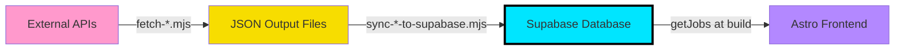

# Data Architecture - Job Board

> **TL;DR**: Supabase é a fonte da verdade. Fetchers → Supabase → Frontend (build time).

---

## 📊 Overview



---

## 🏗️ Architecture Layers

### **Layer 1: External APIs (Data Sources)**

**Location**: Greenhouse, Ashby, Lever APIs  
**Scripts**: `scripts/fetch-*.mjs`  
**Output**: `scripts/*-jobs-output.json` (temporary files)

```bash
npm run fetch:greenhouse  # Greenhouse API → greenhouse-jobs-output.json
npm run fetch:ashby       # Ashby API → ashby-jobs-output.json
npm run fetch:lever       # Lever API → lever-jobs-output.json
npm run fetch:all         # All sources (sequential)
```

**What they do:**
- Query external job APIs
- Transform to our internal Job format
- Apply intelligent categorization (`categorizeJob()`)
- Extract tags, parse locations, format salaries
- Write to temporary JSON files

**When to run:**
- Every 6-12 hours via cron
- Manually when adding new companies
- After updating categorization logic

---

### **Layer 2: Supabase Database (Source of Truth)**

**Location**: Supabase PostgreSQL  
**Scripts**: `scripts/sync-*-to-supabase.mjs`  
**Tables**: `jobs`, `companies`, `categories`, `tags`, `job_tags`

```bash
npm run sync:greenhouse   # greenhouse-jobs-output.json → Supabase
npm run sync:all          # All sources (orchestrated)
```

**What they do:**
- Read JSON output from fetchers
- **Upsert** jobs (insert new, update existing based on `external_id`)
- Create/update related entities (companies, categories, tags)
- Apply AI enhancement to descriptions (via Gemini/OpenAI)
- Set `status: 'active'` for valid jobs
- Mark missing jobs as `'inactive'`

**Database Schema:**
```sql
jobs
├── id (UUID)
├── external_id (TEXT, unique) -- "GH-123", "ASH-456"
├── company_id (FK)
├── category_id (FK)
├── title, description, apply_link
├── location_scope, location_note
├── salary (JSONB)
├── status ('active', 'inactive', 'draft')
├── posted_date, created_at, updated_at

companies (id, name, logo_url, slug)
categories (id, name, slug, color)
tags (id, name, slug)
job_tags (job_id, tag_id) -- Many-to-many
```

**Why Supabase?**
- **Single source of truth**: No data duplication
- **Relational integrity**: Proper foreign keys
- **Real-time**: Admin dashboard can approve/reject jobs
- **Scalable**: Handles thousands of jobs easily
- **Backup**: Automatic backups by Supabase

---

### **Layer 3: Astro Frontend (Build Time)**

**Location**: `src/pages/*.astro`  
**Data fetching**: `src/lib/getJobs.ts`

```javascript
// src/pages/index.astro
const jobs = await getJobs(); // Queries Supabase at build time
```

**What it does:**
- Queries Supabase during `astro build`
- Generates static HTML pages
- **No runtime database queries** (SSG = Static Site Generation)
- Deployed to Vercel

**Build triggers:**
1. Manual: `git push origin main` → Vercel auto-deploys
2. Cron: GitHub Actions can trigger rebuilds after sync
3. Webhook: Supabase can notify Vercel of data changes

---

## 🗑️ Deprecated Files

### ❌ `src/data/jobs.json`

**Status**: OBSOLETE (will be removed)  
**Why it exists**: Legacy from pre-Supabase era  
**Current problem**: Causes confusion about data flow

**Should I delete it?**
- **Keep for now**: As a backup/fallback
- **Use case**: Local development if Supabase is down
- **Long-term**: Remove once confident in Supabase stability

**Alternative**: Create `sync:supabase → jobs.json` script for emergencies

---

## ⚙️ Cron Job Setup (Recommended)

### **Option 1: GitHub Actions (Recommended)**

Create `.github/workflows/sync-jobs.yml`:

```yaml
name: Sync Jobs from External APIs

on:
  schedule:
    - cron: '0 */6 * * *'  # Every 6 hours
  workflow_dispatch:        # Manual trigger

jobs:
  sync:
    runs-on: ubuntu-latest
    steps:
      - uses: actions/checkout@v3
      
      - uses: actions/setup-node@v3
        with:
          node-version: '18'
      
      - run: npm ci
      
      - name: Sync all jobs to Supabase
        run: npm run sync:all
        env:
          SUPABASE_URL: ${{ secrets.SUPABASE_URL }}
          SUPABASE_SERVICE_ROLE_KEY: ${{ secrets.SUPABASE_SERVICE_ROLE_KEY }}
          GOOGLE_GEMINI_API_KEY: ${{ secrets.GOOGLE_GEMINI_API_KEY }}
      
      - name: Trigger Vercel rebuild
        run: curl -X POST ${{ secrets.VERCEL_DEPLOY_HOOK }}
```

**Pros:**
- Free (GitHub Actions)
- Easy to monitor (GitHub UI)
- Integrated with repo
- Can trigger Vercel rebuilds

---

### **Option 2: Vercel Cron Jobs**

Create `vercel.json`:

```json
{
  "crons": [{
    "path": "/api/cron/sync-jobs",
    "schedule": "0 */6 * * *"
  }]
}
```

Create `src/pages/api/cron/sync-jobs.ts`:

```typescript
import type { APIRoute } from 'astro';
import { execSync } from 'node:child_process';

export const GET: APIRoute = async ({ request }) => {
  // Verify cron secret
  const authHeader = request.headers.get('authorization');
  if (authHeader !== `Bearer ${import.meta.env.CRON_SECRET}`) {
    return new Response('Unauthorized', { status: 401 });
  }

  try {
    execSync('npm run sync:all', { stdio: 'inherit' });
    return new Response('Jobs synced successfully', { status: 200 });
  } catch (error) {
    return new Response('Sync failed', { status: 500 });
  }
};
```

**Pros:**
- Integrated with Vercel
- Can trigger rebuilds automatically
- No GitHub Actions needed

**Cons:**
- Requires Pro plan for cron jobs
- Less flexible than GitHub Actions

---

## 📋 Complete Workflow

### **Development (Local)**

```bash
# 1. Fetch jobs from APIs
npm run fetch:all

# 2. Sync to Supabase
npm run sync:all

# 3. Start dev server (reads from Supabase)
npm run dev
```

---

### **Production (Automated)**

```
Every 6 hours:
├─> GitHub Action runs
├─> npm run sync:all
│   ├─> fetch:greenhouse → sync:greenhouse
│   ├─> fetch:ashby → sync:ashby (TODO)
│   └─> fetch:lever → sync:lever (TODO)
├─> Jobs updated in Supabase
└─> Trigger Vercel rebuild (webhook)
    └─> Astro queries Supabase
        └─> Generates static pages
            └─> Deploys to Vercel
```

---

## 🔧 Scripts Reference

### **Fetchers** (External APIs → JSON)

| Script | Source | Output |
|--------|--------|--------|
| `fetch:greenhouse` | Greenhouse API | `greenhouse-jobs-output.json` |
| `fetch:ashby` | Ashby API | `ashby-jobs-output.json` |
| `fetch:lever` | Lever API | `lever-jobs-output.json` |
| `fetch:all` | All sources | All JSON files |

### **Sync** (JSON → Supabase)

| Script | Input | Output |
|--------|-------|--------|
| `sync:greenhouse` | `greenhouse-jobs-output.json` | Supabase jobs table |
| `sync:all` | All JSON files | Supabase (all sources) |
| `sync:supabase` | Supabase | `src/data/jobs.json` (reverse sync) |

### **Combined** (One-liner)

| Script | What it does |
|--------|-------------|
| `sync:greenhouse:supabase:full` | Fetch Greenhouse + Sync to Supabase |
| `sync:all` | **Fetch ALL + Sync ALL** (master script) |

---

## 🚨 Troubleshooting

### **Jobs not appearing on site**

1. Check Supabase has jobs:
   ```bash
   npm run test:supabase
   ```

2. Check jobs are `active`:
   ```sql
   SELECT status, COUNT(*) FROM jobs GROUP BY status;
   ```

3. Rebuild site:
   ```bash
   npm run build
   ```

### **Fetchers failing**

- Check API keys in `.env`
- Check rate limits (Greenhouse: 50 req/min)
- Check company slugs are correct

### **Categorization wrong**

- Update `src/lib/categories.ts` → `categorizeJob()`
- Re-run fetchers + sync
- Check unit tests: `npm run test tests/lib/categories.test.ts`

---

## 📝 TODO

- [ ] Create `sync-ashby-to-supabase.mjs`
- [ ] Create `sync-lever-to-supabase.mjs`
- [ ] Implement GitHub Actions cron
- [ ] Add Vercel deploy webhook to cron
- [ ] Monitor: Set up alerts for failed syncs
- [ ] Decide: Keep or remove `src/data/jobs.json`

---

## 📚 Related Docs

- [CATEGORIES_GUIDE.md](./CATEGORIES_GUIDE.md) - Categorization logic
- [FETCHERS_GUIDE.md](./FETCHERS_GUIDE.md) - How to add new job sources
- [SUPABASE_SETUP.md](./SUPABASE_SETUP.md) - Database schema and setup
- [ENHANCEMENT_SYSTEM.md](./ENHANCEMENT_SYSTEM.md) - AI description enhancement

